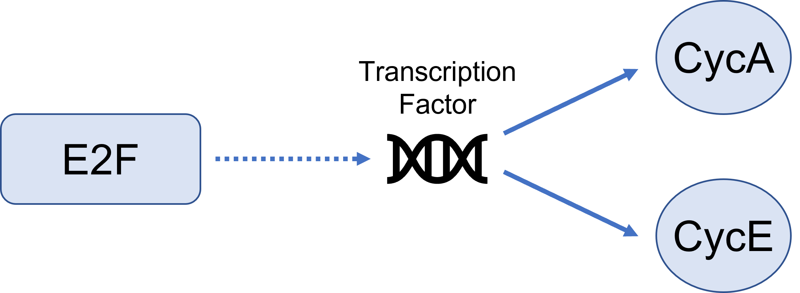

============================
Synthesis Reactions
============================

Synthesis
------------------------------
Synthesis by rate has a species generated at a specific rate. This is useful 
for when the user does not particularly now what is causing the synthesis but
knows how quickly it is being produced. It simply creates a constant rate of
production. 

.. math::
    \begin{equation*}
        \frac{d[Species]}{dt} = k_{syn}
    \end{equation*}

where,

:|ksyn|: synthesis rate of species

.. |ksyn| replace:: :math:`k_{syn}`

Synthesis by Factor 
------------------------------------

The "By Factor" law is used when a factor directly influences the synthesis of 
a species but is not directly converted. An example of this is in the Cell
Cycle when the molecule E2F activates transcription factors that synthesize 
Cyclin E and Cyclin A. If the cell contains no E2F, then there is no synthesis 
of Cyclin E or A. 

There is only one resultant mathematical flux from this type of synthesis and 
that is the species being synthesized. The factor causing the synthesis does 
not have its flux altered. The general resulting equations are: 

.. math::
    \begin{align*}
        \frac{d[Species]}{dt} &= k_{syn}*[Factor] \\
        \frac{[Factor]}{dt} &= 0
    \end{align*}

where,

:|ksyn|: synthesis rate of species
:Species: species that is being synthesized
:Factor: factor that is causing the synthesis

In realtion to the above E2F equation, the differeneital equations are: 

.. math::
    \begin{align*}
        \frac{d[CycA]}{dt} &= k_{syn}*[E2F] \\
        \frac{d[CycE]}{dt} &= k_{syn}*[E2F] \\
        \frac{d[E2F]}{dt} &= 0 \\
    \end{align*}