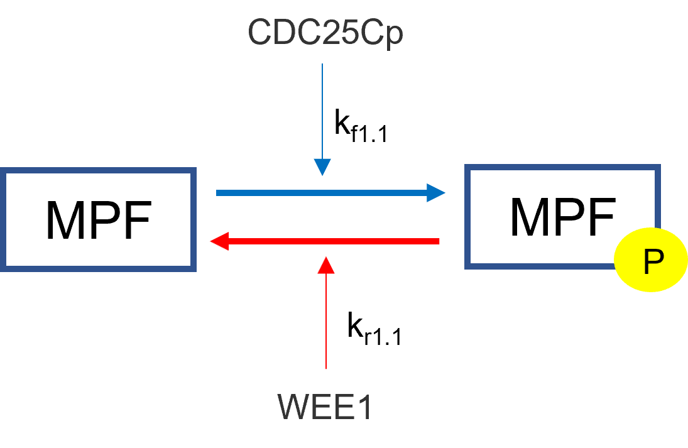

============================
Chemical Based Equations
============================

Law of Mass Action 
----------------------------
Chemical reactions are derived using the law of mass action. Given the following
chemical reaction scheme: 

.. math::
    \begin{equation*}
        aA + bB \longleftrightarrow[k_{-1}]{k_1} cC + dD
    \end{equation*}

where a, b, c, d are stoichiometic coefficients and A, B, C, D are the chemical
species. The law is as follows:

.. math:: 
     \begin{equation*}
        -\frac{1}{a}\frac{d[A]}{dt} = -\frac{1}{b}\frac{d[B]}{dt} = 
        \frac{1}{c}\frac{d[C]}{dt} = \frac{1}{d}\frac{d[D]}{dt} =
         k_1[A]^a[B]^b - k_{-1}[C]^c[D]^d 
    \end{equation*}

From the above law, each individual term can is derived below:

.. math:: 
    \begin{align*}
        \frac{d[A]}{dt} &= -a*k_1[A]^a[B]^b + a*k_2[C]^c[D]^d \\
        \frac{d[B]}{dt} &= -b*k_1[A]^a[B]^b + b*k_2[C]^c[D]^d \\
        \frac{d[C]}{dt} &= c*k_1[A]^a[B]^b - c*k_2[C]^c[D]^d \\
        \frac{d[D]}{dt} &= d*k_1[A]^a[B]^b - d*k_2[C]^c[D]^d
    \end{align*}

Each individual equation will be added to their overall flux differential
equation in the differential equation solver section.

Law of Mass Action with Regulation
--------------------------------------------
Mass action with regulation is for chemical reactions who have rate constants 
that are dependent on other species. An example is the regulation of inactive 
MPF to active MPF in the cell cycle by WEE1 and CDC25Cp. In this example, 
inactive MPF is phosphorylated by CDC25Cp and dephosphorylated by WEE1. These 
regulators are not directly affected in the their differential equations in 
this situation while inactive and active MPF are. We have the same derivation
as mass action except the rate constants are changed to reflect the regulation.  

The regulators will take the respective place of the rateconstants in the 
mass action derivation.  In the mass action derivation above for "a" and "b"
we have: 

.. math::
    \begin{align*}
        \frac{d[A]}{dt} &= -a*k_1[A]^a[B]^b + a*k_2[C]^c[D]^d \\
        \frac{d[B]}{dt} &= -b*k_1[A]^a[B]^b + b*k_2[C]^c[D]^d 
    \end{align*}

Adding regulator replaces the respective rate constant with the sum of 
its regulators and rateconstants:

.. math:: 
    \begin{align*}
        \frac{d[A]}{dt} &= -a*(\sum{[kf_i*reg_i]})[A]^a[B]^b +
        a*(\sum{[kr_i*reg_i]})[C]^c[D]^d \\
        \frac{d[B]}{dt} &= -b*(\sum{[kf_i*reg_i]})[A]^a[B]^b +
        b*(\sum{[kr_i*reg_i]})[C]^c[D]^d
    \end{align*}

Using the above example, we get the following result:

.. math::
    \begin{align*}
        \frac{d[MPF]}{dt} &= -(k_{f1.1}*CDC25Cp)*MPF - (k_{r1.1}*WEE1)*MPFp \\
        \frac{d[MPFp]}{dt} &= (k_{f1.1}*CDC25Cp)*MPF + (k_{r1.1}*WEE1)*MPFp  
    \end{align*}