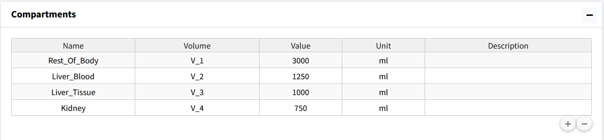

============================
Create Compartments
============================

We will start by setting up our four compartments in this model:
Rest_Of_Body, Liver_Blood, Liver_Tissue, Kidney. 

Steps: 

#. Start my going to the **Compartments** box in the **Create Model** tab.
#. Press the "**+**"" button three times to add three comparments. 
#. Change the Names of the compartments in the table.
#. Change the corresponding volume names (we will use numerical naming in
   this tutorial): V_1, V_2, V_3, and V_4.
#. Change the volume value and units to match parameter table (these values can
   also be changed in the parameter table for the model). 

The end result should be the following table: 

