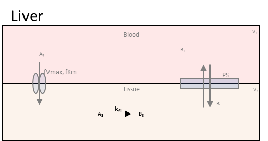
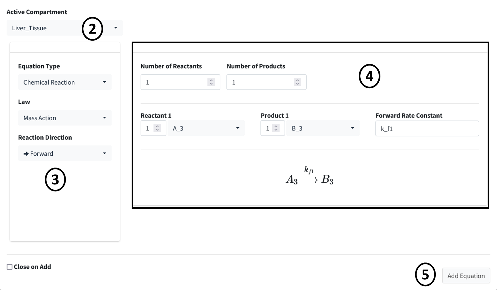

============================
Add Equations
============================

This tutorial model has only one reaction: the conversion of A to B (**A3** & 
**B3**) in the liver tissue.

Steps: 

#. Scroll down to the **Equations** box in the **Create Model** tab. Press 
   the addition button below the equation table. 
#. Change the **Active Compartment** to "Liver_Tissue".
#. Change the **Reaction Direction** to "Forward" since this is a one way reaction.
#. This reaction has one product and one reactant. Make sure **Reactant 1** is 
   **A_3** and **Product 1** is **B_3**. Make the **Forward Rate Constant** 
   to **k_f1**.
#. Press the **Add Equation** button. 

