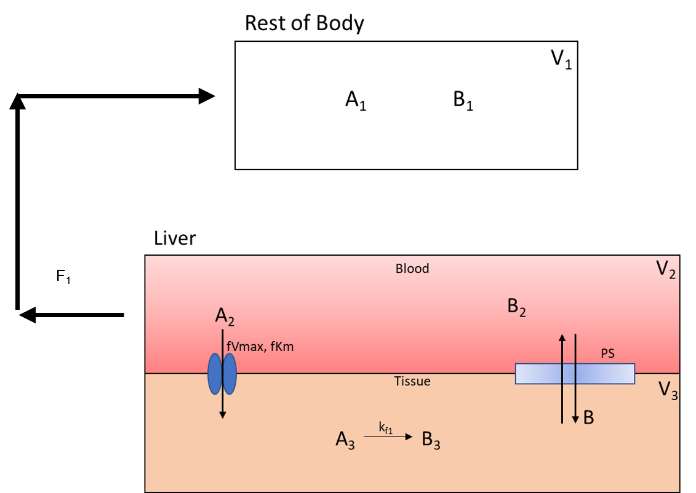
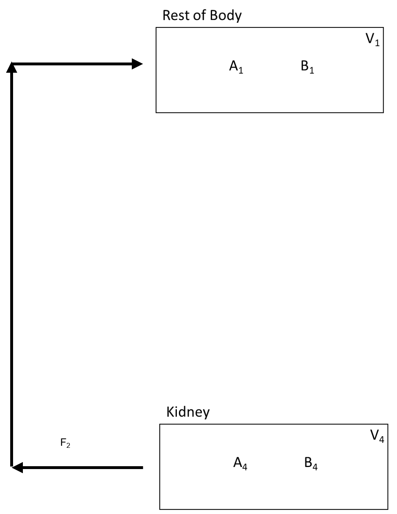

===============================
Add Compartment Inputs/Outputs
===============================

In this section of the tutorial, we will cover how to add flows, inputs, and 
outputs of compartments to the model. Begin by scroling to the 
**Input/Output** box on the **Create Model** Tab.  We will being by adding 
the flows between species. Again, here is the overall flow model: 

.. container:: bordergrey

    .. figure:: images/flow_diagram.png
        :scale: 40%
        :align: center

In each subsequent section we break down the flows into individual components.

1. Flow Out of Body
----------------------------

The flow out of the **Rest_Of_Body** is split into two flow rates as it moves
speices **A** and **B** to the **Liver_Blood** and **Kidney**.  Below is the 
part of the flow diagram we will be entering:

.. container:: bordergrey

    .. figure:: images/flow_diagram_rob.png
        :align: center
        :scale: 40%

#. In **Options** select **Flow Between Compartments**. This is used to account
   for flows leaving one compartment and entering one or more compartments.
#. Select the **Split Flow** checkbox. This option is selected when one outflow
   is being split into multiple flows.  Keep **Number of Splits** to **2** as
   we are spliting the flow to two compartments. 
#. Set the information for the compartment the flow is leaving from. It has the 
   following specifications: 

   * **Flow_Out_of**: Rest_Of_Body
   * **Species Out**: A_1
   * **Flow Variable**: F
   * **Flow Value**: 5

   Current specifications need to have species in flow entered one at a time. 
   Meaning a new flow will be added for species **B**. With all paramters, 
   values can be changed at a later time in the parameter section.

#. Set the information from the first split flow into **Liver_Blood**. Enter 
   the following: 

   * **Flow_Out_of**: Liver_Blood
   * **Species Out**: A_2
   * **Flow Variable**: F_1
   * **Flow Value**: 3

#. Set the information from the second split flow into **Kidney**. Enter 
   the following: 

   * **Flow_Out_of**: Kidney
   * **Species Out**: A_4
   * **Flow Variable**: F_2
   * **Flow Value**: 2

   .. container:: botTopMargin

    .. figure:: images/io_2_flow_between_A_marked.png
        :align: center
        :width: 670
        :height: 320

#. Repeat the following for species **B**. This should involve only changing 
   the **Species** dropdowns. 

    .. figure:: images/io_3_flow_between_B.png
        :align: center
        :width: 670
        :height: 320

.. note::
    When adding **B**, we are reusing the flow variables **F**, **F_1**, and 
    **F_2**.  The first values entered for these are stored.  Changing the flow
    values will not have any effect. To change the flow values, go to the 
    parameter table. 

2. Flow Back: Liver to Body
----------------------------

The flow back from the liver to the rest of the body looks like: 

This is like the previous step but with the compartments switched around. 

3. Flow Back: Kidney to Body
-----------------------------

The flow back from the kidney to the rest of the body is: 

