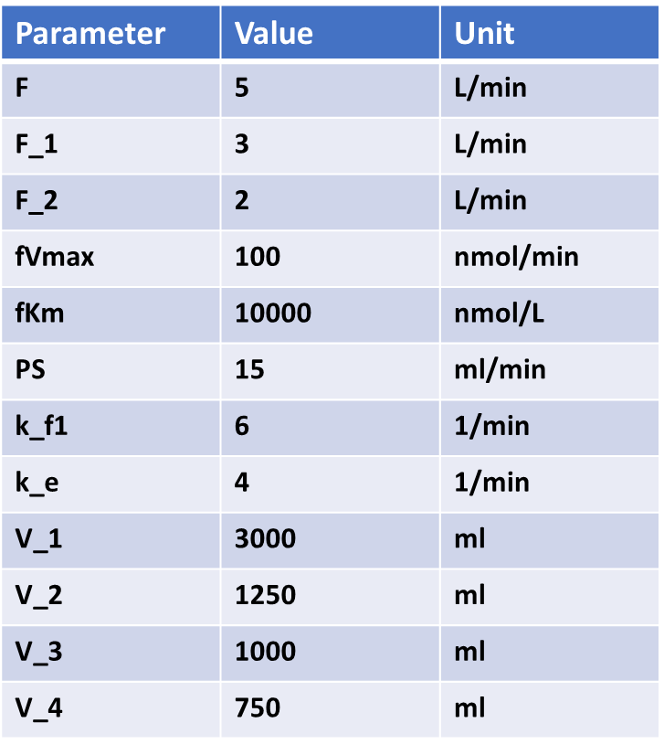

Parameters 
=============

Navigate to the next box: **Parameters**. 

Below is the generated parameter table that has been created so far by the 
above entered information. All descriptions are pregenerated based on where 
the parameter originated. Like other tables, all values are editable.

.. figure:: images/param_0.png

The parameter values for the model are as follows: 

The below figure shows the parameter table with the values entered.

.. figure:: images/param_1.png

.. note:: In the Figure above, the flow values where changed to match the table
          values going from L/min to ml/min. Unless changed the default units 
          are in L/min. We changed both the units and the values but they 
          could have stayed at their inputted values from earlier.