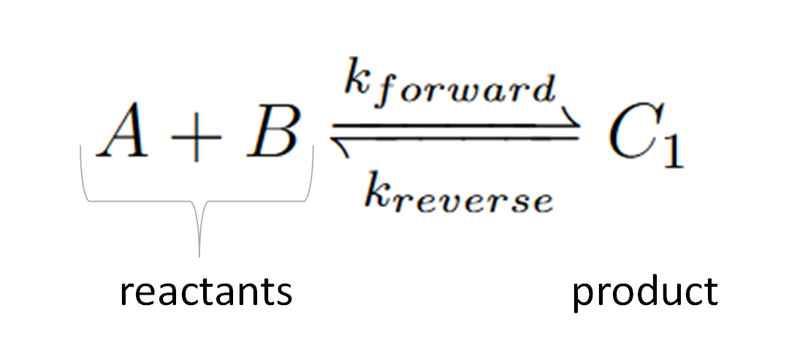

============================
Create Equations
============================

Scroll down to the "Equations" box in the "Create Model" tab.   In this
section we will build up the sets of reactions that make up our reaction 
network.

Law of Mass Action, Reversible
-----------------------------------------------

|

Chemical reactions like this follow the :underline:`law of mass action`. 
This first equation is a reversible reaction. The equation consists of two 
reactants, one product, and moves in both directions where are forward rate 
constant is “k_f1” and our reverse is “k_r1”.   

